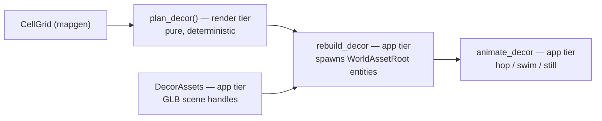

# Fauna & Flora Rendering Specification

Decorative fauna (animals, fish) and flora (trees, palms, flowers, grass props) for the voxel biomes. Everything in this
document is **implemented** (see the change log at the bottom). Companion to `rendering.md`, which owns the terrain
pipeline this system stands on.

**Scope guard:** all fauna & flora are _decoration only_. No game logic reads these entities; the cell grid (mining,
connections, invariants) never changes. When gameplay later needs animals (livestock? hunting?), that becomes a new
sim-tier feature with its own spec — this pipeline stays the presentation layer.

---

## Architecture: three tiers, three responsibilities

The pipeline is split so each concern lives in exactly one place, mirroring the terrain's mapgen → expansion → scene
split. Extending one tier (new model, new placement rule, new animation) never touches the other two.

| Tier                | Crate / module        | Responsibility                                                                       | Engine-coupled?                     |
|---------------------|-----------------------|--------------------------------------------------------------------------------------|-------------------------------------|
| Catalog + placement | `voxel-render::decor` | What kinds exist, which models they use, deterministic planning of what stands where | No ECS, no assets (pure + testable) |
| Asset management    | `voxel-app::assets`   | Workspace asset root, GLB scene handles, load tracking, palette harmonization        | Bevy `AssetServer`                  |
| Scene + animation   | `voxel-app::decor`    | Spawning planned instances as entities, despawn on rebuild, idle animations          | Bevy ECS systems                    |



### Why the planner lives in `render`, not `app` or `mapgen`

- Not `mapgen`: decorations are cosmetic. Mapgen owns anything that changes cell types (the BEACHES precedent);
  decorations never do.
- Not `app`: placement must be a pure function (same seed → same plan, headless-testable) exactly like the expansion and
  beautify passes. `app` is where per-frame, stateful, non-deterministic things live (clouds, animation).
- `render::decor` is a sibling of `render::expansion`: both derive deterministic visuals from the cell grid.

### Determinism contract

Every random choice is `rule_hash01` on **world cell coordinates** with a per-kind rule id — the same formula as the
beautify passes (`rendering.md`, "Determinism seed formula"). Plans are therefore deterministic per seed, identical on
every platform, and independent of biome generation order. Rule-id blocks (each kind owns 8 ids: presence, variant, yaw,
jitter ×2, scale, phase):

| Rule block  | Id   | Notes                                                      |
|-------------|------|------------------------------------------------------------|
| beautify    | 1–5  | see rendering.md                                           |
| BEACHES     | 6    | mapgen tier                                                |
| caves       | 8–46 | underground cave pockets (rendering.md, underside erosion) |
| TREES       | 64   |                                                            |
| PALMS       | 72   |                                                            |
| FLOWERS     | 80   |                                                            |
| GRASS PROPS | 88   |                                                            |
| ANIMALS     | 96   |                                                            |
| FISH        | 104  |                                                            |

The **animations** are intentionally time-based (like the clouds) and therefore not byte-stable across runs. Byte-stable
screenshots disable them: `--no-decor` on `cargo xtask screenshot` and the native `inspect`/`screenshot` commands, plus
the "Fauna & flora" checkbox in the inspector.

---

## Asset pipeline

Curated, runtime-ready assets live in the workspace-root **`assets/`** directory — the raw Kenney packs in `imports/`
are source archives and are **never referenced at runtime**. To add a model: copy the GLB from `imports/` into the right
`assets/models/` subfolder, add a catalog entry with a measured scale (see below), done.

```
assets/
└── models/
    ├── fauna/                      ← kenney_cube-pets (CC0)
    │   ├── animal-*.glb            (11 animals incl. fish)
    │   ├── Textures/colormap.png   (shared texture the GLBs reference by relative path)
    │   └── LICENSE-kenney-cube-pets.txt
    └── flora/                      ← kenney_nature-kit (CC0)
        ├── tree_*.glb  flower_*.glb  grass*.glb  plant_bushSmall.glb
        └── LICENSE-kenney-nature-kit.txt
```

- **Asset root**: Bevy's default asset root resolves against the running package's manifest dir, which breaks in a
  workspace (`cargo run -p native` would look in `platforms/native/assets`). `voxel-app::assets::asset_plugin()` bakes
  the workspace-root `assets/` path at compile time for native builds; wasm keeps the default relative `assets/` URL
  (served next to the site).
- **Loading**: `DecorAssets` (a `FromWorld` resource) requests every catalog GLB once at plugin init, indexed
  `[kind][variant]`. Handles are cheap; the GLBs stream in asynchronously and instances pop in when ready. The
  screenshot runner waits on `DecorAssets::all_loaded` (with a frame cap) so captures never show half-loaded props.
- **Bevy 0.19 note**: glTF scenes load as `WorldAsset` and spawn via `WorldAssetRoot` (the classic `Scene`/`SceneRoot`
  are retired).
- **Scale calibration**: catalog `scale` values are baked from measured GLB bounds (docs'd per entry). Targets: animals
  fit a 0.5-unit box (= 2×2 voxels), trees ≈ 1.7 world units tall, palms ≈ 1.3–1.8, flowers ≈ 0.2–0.4, fish small enough
  to stay fully submerged in the 0.5-unit-deep water. Per-instance scale jitters ±15%.
- **Palette harmonization**: Kenney's nature-kit foliage is teal (`leafsGreen` ≈ linear (0.16, 0.79, 0.67)) and clashes
  with the terrain's yellow-green. `voxel-app::assets::harmonize_decor_materials` retints exactly three known foliage
  colors to palette greens when their materials finish loading; petals, bark, and the cube-pets colormap texture pass
  through untouched. GLB materials are shared per asset, so one retint covers all instances.

| Source color (linear) | Kenney name  | Retint target (sRGB) |
|-----------------------|--------------|----------------------|
| (0.161, 0.788, 0.671) | `leafsGreen` | (0.33, 0.68, 0.22)   |
| (0.169, 0.651, 0.667) | `leafsDark`  | (0.22, 0.52, 0.19)   |
| (0.173, 0.847, 0.722) | `grass`      | (0.41, 0.75, 0.26)   |

---

## Catalog

Kinds, their model variants, and where they may stand. "Grass top" = an exposed soil cell (which the expansion crowns
with grass voxels) — placement is cell-tier, so beach sand and pond water made by mapgen are seen correctly.

| Kind       | Variants                                                | Stands on               | Extra placement constraints                                                           |
|------------|---------------------------------------------------------|-------------------------|---------------------------------------------------------------------------------------|
| Tree       | tree_default, tree_oak, tree_pineDefaultA, tree_simple  | soil (grass) tops       | interior only (off the edge ring); local-flat (no higher 8-neighbour)                 |
| Palm       | tree_palm, tree_palmShort, tree_palmTall, tree_palmBend | sand tops **only**      | interior only; local-flat                                                             |
| Flower     | flower\_{purple,red,yellow}{A,C}                        | soil (grass) tops       | —                                                                                     |
| Grass prop | grass, grass_large, plant_bushSmall                     | soil (grass) tops       | — (replaces the removed GRASS TUFTS voxel rule)                                       |
| Animal     | see habitat table below                                 | any solid non-water top | never on a raised ledge that drops into water (reads as floating from the iso camera) |
| Fish       | animal-fish                                             | surface water cells     | anchored near the cell floor, fully submerged                                         |

### Animal habitats

Animals pick their variant from the habitat group of the cell they stand on:

| Habitat  | Top cell type       | Animals                           |
|----------|---------------------|-----------------------------------|
| Meadow   | soil (grass top)    | bunny, fox, deer, pig, chick, cow |
| Beach    | sand                | crab, parrot                      |
| Mountain | stone / gold / iron | penguin, polar bear               |

### Densities (probability per eligible top cell)

At most **one decoration per cell**: flora and fish are planned first (first matching rule wins), animals fill remaining
free cells in a second pass — which is what lets tree positions boost animal density nearby.

| Kind             | Probability            | Notes                                                    |
|------------------|------------------------|----------------------------------------------------------|
| Tree             | 0.06                   |                                                          |
| Palm             | 0.06                   |                                                          |
| Flower           | 0.10                   | rolled only where no tree landed                         |
| Grass prop       | 0.12                   | rolled only where no tree/flower landed                  |
| Fish             | 0.10                   |                                                          |
| Animal, meadow   | 0.05 (+0.05 near tree) | "near tree" = a planned tree within Chebyshev distance 2 |
| Animal, beach    | 0.03                   |                                                          |
| Animal, mountain | 0.02                   |                                                          |

### Anchoring

Instances sit at the cell center ± a small lateral jitter (±0.15 cells for trees/palms, ±0.2 otherwise — small enough to
stay on the flat inner 2×2 voxels that the slope/fracture passes never carve). Anchor height mirrors the `cell_column`
visual patterns:

| Top cell    | Anchor Y above cell base | Why                                                 |
|-------------|--------------------------|-----------------------------------------------------|
| soil, stone | 1.0                      | grass/snow/stone top is flush with the cell top     |
| sand        | 0.75                     | sand tops render one voxel sunken                   |
| water       | 0.05                     | fish anchor near the floor; water surface is at 0.5 |

Placement is **layer-peel aware**: with a cutoff set, columns are read as the expansion sees them, so peeling re-plans
decor on the freshly exposed surface exactly as peeled soil regrows a grass top.

---

## Animation

Derived from the kind at spawn time (`voxel-app::decor::Motion`). Pure `Transform` work off Bevy `Time` — no skeletal
animation, matching the chunky diorama style. Every instance carries a planner-hashed `phase` in [0, 1) so neighbours
never move in lockstep.

| Motion | Kinds        | Behaviour                                                                                         |
|--------|--------------|---------------------------------------------------------------------------------------------------|
| Still  | all flora    | none (wind sway is a possible future extension — add a `Motion::Sway` arm)                        |
| Hop    | land animals | small parabolic hop (≤ 0.16 world units) once per 2.2–4 s cycle, plus a lazy look-around yaw sway |
| Swim   | fish         | one lap of a 0.15-radius circle every 12–20 s, gentle vertical bob, nose along the swim tangent   |

---

## Scene lifecycle

- `rebuild_decor` (app tier) despawns and re-plans **all** decorations whenever the same inputs that rebuild the terrain
  scene change — `WorldMapResource`, `FocusedBiome`, `LayerCutoff` — or the `DecorEnabled` toggle flips. Entities are
  tracked in `SceneEntities::decorations`, next to the biome meshes and proxy tiles.
- Decorations exist on the **focused biome only**. Proxy slabs get none (props would be sub-pixel at that distance);
  decorating proxies with a few billboard trees is a possible future extension.
- Rough budget: a 12×12 biome yields ~20–40 instances (see densities) — negligible against the 48³ terrain mesh.

---

## Testing

`crates/render/src/decor.rs` unit tests (headless, run with the usual `cargo test -p voxel-render`):

- same seed → identical plan; different seed → different plan
- every placement rule holds over a full generated world (palms on sand, trees/flowers/grass on soil, fish in water and
  fully submerged, animals on solid ground, edge-ring exclusion, anchor heights)
- every kind appears somewhere in the seed-42 world (densities can't silently zero out)
- variants stay inside catalog bounds and animal variants inside their habitat groups
- peeling re-plans onto the exposed surface

Terrain-side guarantees the props rely on (tested in `beautify.rs` / `expansion.rs`): **FLAT TOPS** (nothing pokes above
a flat grass field's top plane) and the **no-pinhole** underground rule.

---

## Change log

**v1.0 — initial implementation.** Kenney cube-pets (11 animals) + nature-kit (17 flora models) curated into `assets/`;
three-tier planner/assets/scene architecture; deterministic cell-tier placement with habitat groups and tree-proximity
animal boost; hop/swim transform animations; palette harmonization for nature-kit foliage; `--no-decor` flag and
inspector toggle. Terrain prerequisites shipped alongside: GRASS TUFTS voxel rule removed in favour of grass props (FLAT
TOPS contract), underground pinhole seal + cave pockets (see rendering.md v0.5).
