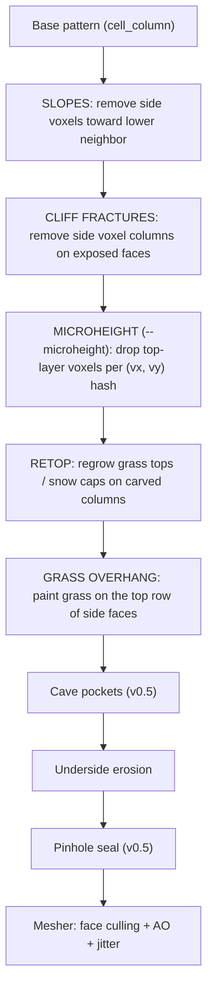

# Rendering Specification

A god-game / early-RTS in the spirit of _Mega-Lo-Mania_ (Sensible Software, 1991), rendered as voxel biomes. Target:
WebAssembly + wgpu (web). Future: iOS. Development is LLM-assisted (Claude CLI) with the user as architect.

This document describes the **implemented** Phase 1 terrain renderer (see `crates/render`, `crates/mapgen`) plus the
agreed design direction for later phases. Sections marked _future scope_ are not implemented yet.

**Change log — v0.5.** Decoration props are now **implemented** — see the companion spec `rendering-fauna-flora.md`
(trees, palms, flowers, grass props, animals, fish; curated `assets/` pipeline). Terrain changes shipped alongside:
**GRASS TUFTS removed** (the single-voxel tufts read as pimples on flat fields; grass props replace them — the new
**FLAT TOPS** contract says nothing ever writes above a cell's own top plane, so fauna & flora can stand on grass); the
underside erosion gained a **pinhole seal** (no single-voxel air holes underground — isolated one-voxel pits read as
termite damage; air voxels with ≥5 solid face-neighbours are refilled to a fixpoint) and deterministic **cave pockets**
(0–2 interior ellipsoid voids per biome, below the surface-support band, visible only through the layer peel or an
erosion breach).

**Change log — v0.4.** Terrain Beautification Rules are now **implemented**: CLIFF FRACTURES, SLOPES, GRASS OVERHANG,
GRASS TUFTS, MICROHEIGHT (render tier, `render/src/beautify.rs`); BEACHES (mapgen tier, `mapgen/src/beach_pass.rs`);
CLOUDS (scene tier, `app/src/clouds.rs`). Implementation notes: the render rules run as ordered volume passes with a
RETOP (grass/snow regrow) step folded in after the subtractive rules; MICROHEIGHT ships behind `--microheight` (default
off); tuft coverage was tuned from 15% to ~8% after A/B against the reference art; clouds disable via `--no-clouds` for
byte-stable screenshots.

**Change log — v0.3.** Added the "Terrain Beautification Rules" section (future scope): CLIFF FRACTURES, SLOPES, GRASS
OVERHANG, GRASS TUFTS, MICROHEIGHT (render tier); BEACHES (mapgen tier); CLOUDS (scene tier). Includes tier
classification, expansion pipeline diagram, rule ordering, and the determinism seed formula.

---

## Reference Art

Three concept images live in `docs/reference/`. `sample1.jpg` and `sample3.jpg` are identical (kept as a duplicate
reference); `sample2.jpg` is a distinct piece. Together they set the visual target for a focused biome:

- **`sample1.jpg` / `sample3.jpg`** — smooth, low-poly diorama: snow-capped peaks, pine trees, a sunken pool, a cabin,
  all sitting on a soil block with a clean dirt underside.
- **`sample2.jpg`** — full cubic-voxel diorama (Minecraft-style): blocky terrain built from visible unit cubes and —
  notably — an eroded, jagged underside where the dirt breaks apart into loose gray stone chunks.

**Style decision (resolved):** **terrain** (ground, relief, water) is true cell-voxel geometry — axis-aligned unit cubes
per `sample2`'s language, produced by the `cell → 4×4×4 voxel` expansion. **Props** (trees, animals, later buildings)
are imported 3D models placed on top of the terrain — implemented for fauna & flora, see "Decoration Props" below and
`rendering-fauna-flora.md`. The floating island's jagged underside comes from procedural voxel erosion, per `sample2`.

---

## Terminology

- **Biome** — a 12×12×12 grid of cells, the atomic unit of the world. Biomes are arranged in a 6×6 grid.
- **World** — the 6×6 grid of biomes. Each match happens in one world.
- **Era** — a technological age assigned to each biome. Biomes can be in different eras at the same time.
- **Cell** — the logical unit of gameplay: one type (soil, sand, water, stone, gold, iron, air), holds at most one
  resource, mined by one miner, built on by one building. 12³ cells per biome. Lives in `voxel-core::CellType` /
  `CellGrid`.
- **Voxel** or **Terrain voxel** — the visual sub-unit a cell expands into at render time. Purely cosmetic; no gameplay
  semantics. 4³ voxels per cell. Lives in `voxel-render::VoxelKind` / `VoxelVolume`; `mapgen` and `sim` never see
  voxels.

A biome is therefore **12³ = 1,728 cells logically** and **48³ = 110,592 voxels visually**.

## Gameplay Concept

You are one of four competing deities. You seize biomes on a 6×6 world, settle towers, allocate population to research /
mining / production / armies / defence, advance your civilization through technological ages, and conquer by destroying
every rival tower. You never micro individual units; you allocate population and direct armies at target biomes. Combat
auto-resolves.

### Design pillars (inherited from MLM)

1. **Allocation over micro.** The decision is _how many people on which task_, not clicking soldiers.
2. **Expansion vs. advancement tension.** More towers build armies faster; one strong tower researches faster.
3. **No fog of micromanagement.** Combat, breeding, and mining run themselves once allocated.
4. **Resource-gated tech.** Designs cost elements; elements come from biomes. Where you settle decides what you can
   build.

---

## World Model

### Cell Types (`voxel-core::CellType`)

A cell **is** its resource where one exists — there is no separate element field.

| Cell Type | Band                  | Resource | Notes                                          |
| --------- | --------------------- | -------- | ---------------------------------------------- |
| soil      | Any                   | —        | Dirt; grows a grass top voxel layer if exposed |
| sand      | Surface, relief       | —        | Beach yellow                                   |
| water     | Surface               | water    | Translucent, sunken surface                    |
| stone     | Any                   | stone    | Gray rock; snow-capped in the high relief band |
| gold      | Underground           | gold     | Yellow stone                                   |
| iron      | Underground           | iron     | Reddish stone                                  |
| air       | Underground\*, relief | —        | \*Underground air = outside the island funnel  |

**Snow is not a cell type.** It is a cosmetic `VoxelKind` applied by the expansion to the top voxel layer of exposed
stone cells at cell layer ≥ 11 (`voxel-core::SNOW_Z`).

### Biome anatomy (Z axis in cells, layer 1 = bottom, `z` = layer − 1)

| Layers | Band        | Contents                                                                                                   |
| ------ | ----------- | ---------------------------------------------------------------------------------------------------------- |
| 1–5    | Underground | Floating-island funnel of soil salted with resource deposits. Tapers toward the bottom tip.                |
| 6      | Surface     | Always solid, typed by the biome. Interior ponds in grass/sand biomes. Edge strips are flat and typed.     |
| 7–12   | Above       | Relief: rolling hills + sparse mountain peaks, otherwise air. Cosmetic + line-of-sight flavor; no gameplay |
|        |             | collision in the demo.                                                                                     |

### Connections

- Adjacent biomes connect **only at cell layer 6**, by **surface-type match** (water↔water, sand↔sand, grass↔grass,
  stone↔stone). Incompatible neighbors have **no connection**.
- The one-cell edge ring of every biome is always the biome's own surface type and carries **no relief and no ponds**,
  so compatible borders match cell-for-cell and movement across them is clean. This is enforced by the invariant tests.
- **Gameplay role (proposed, tunable):** edge type gates which armies may cross; water connections require naval- or
  air-capable units (a later tech tier).

---

## Procedural Generation (`mapgen` crate)

`mapgen` operates exclusively on cells and is engine-free (compiles to wasm, runs headless in CI).

`generate(seed) -> WorldMap` runs three passes (the third — BEACHES — is specified under "Terrain Beautification Rules"
below):

1. **Macro pass** (`macro_pass.rs`) — weighted-random `BiomeType` per biome (grass 40 / sand 25 / water 20 / rock 15)
   using `ChaCha8Rng::seed_from_u64(seed)`, then a `Connection` for every internal border (compatible = same type on
   both sides). Connections live in a `BTreeMap` — **never `HashMap` on deterministic paths** (iteration order).

2. **Interior pass** (`interior.rs`) — fills each biome's 12³ `CellGrid`:

- **Underground (z 0–4):** the island funnel. Walked top-down per column: the layer under the surface is always full
  (the surface always has support), deeper layers keep a shrinking, noise-perturbed footprint, and the first cut
  truncates everything below it — so underground mass always hangs from the layer above. Cells inside the funnel are
  soil salted with deposits: **stone ≥ 30%** (denser toward the bottom, so the underside reads as rubble), **iron ~10%**
  (z ≤ 3), **gold ~5%** (z ≤ 2). Rarities are enforced by a loose-bounds invariant test and measurable via
  `cargo run -p voxel-mapgen --example stats`.
- **Surface (z 5):** the biome's surface cell everywhere; grass/sand biomes get interior **ponds** carved where a pond
  noise field exceeds a threshold (never on the edge ring).
- **Relief (z 6–11):** column heights = rolling-hills field **plus** a sparse mountain-peak field (higher frequency than
  the hills — with only 6 relief layers, peaks must stay a few cells wide or they clip into flat-topped mesas). Heights
  fade to zero over the three cells nearest a biome edge. Water biomes and pond cells stay flat. Tall columns (≥ 4) are
  bare stone (mountains); low relief keeps the biome's surface material; rock biomes are stone throughout. No floating
  cells by construction.

3. **Beach pass** (`beach_pass.rs`) — flips soil surface cells near large ponds to sand (see "BEACHES" below for the
   full rule).

### Determinism contract

- All interior noise is Perlin, seeded from the world seed via `derive_u32(seed, offset)` and sampled in **world cell
  coordinates** (`biome_col * 12 + local_x`), so fields are continuous across borders and biome generation order can
  never affect results. The ChaCha RNG feeds the macro pass only.
- **Tests** (`crates/mapgen/tests/invariants.rs`, headless): same-seed byte-equality, per-band cell-type constraints,
  underground hangs-from-above, edge-ring purity, compatible-border strip equality, resource rarity bounds, proptest
  over random seeds, and insta ASCII snapshots. Regenerate snapshots after intentional changes with
  `INSTA_UPDATE=always`.

---

## Cell → Voxel Expansion (`render/src/expansion.rs`)

The expansion is a pure function of the cell grid, the inspector's layer cutoff, and the biome's world position + seed.
`cell_column(cell, top_air, cz)` gives each cell's 4 voxel sub-layers (also rendered as swatches in the inspector's
"Cell → voxel patterns" panel):

**Top Z == air** means the cell above is air (or peeled away by the layer cutoff — peeled soil regrows a grass top,
exactly like natural terrain).

| Cell Type | Rule                     | Voxel column (bottom → top)           |
| --------- | ------------------------ | ------------------------------------- |
| soil      | Top Z == air             | dirt, dirt, dirt, **grass**           |
| soil      | Top Z != air             | dirt ×4                               |
| sand      | Top Z == air             | sand ×3, **air** (sunken)             |
| sand      | Top Z != air             | sand ×4                               |
| water     | Top Z == air             | water ×2, **air ×2** (sunken surface) |
| water     | Top Z != air             | water ×4                              |
| stone     | Top Z == air and cz ≥ 10 | stone ×3, **snow**                    |
| stone     | otherwise                | stone ×4                              |
| gold      |                          | gold ×4                               |
| iron      |                          | iron ×4                               |
| air       |                          | (no voxels)                           |

### Underside erosion (the "floating island" break)

After expansion, two erosion passes nibble voxels off the exposed underground boundary (side/bottom exposure only —
peeled top layers stay crisp), with probability rising toward the island's bottom tip. Combined with the cell-tier
funnel this turns clean cell-sized steps into the ragged rubble underside of `sample2`. Deterministic per world voxel
coordinate + seed (`voxel_hash01`), so screenshots are stable. This is render-side cosmetics: it never touches `mapgen`
data or its invariant tests.

Two underground passes bracket the erosion (both render-tier, deterministic, v0.5):

- **Cave pockets** (before erosion): 0–2 ellipsoid voids per biome (lateral radii 3–6 voxels, flatter than wide), carved
  into the underground mass strictly below the cell band under the surface (voxel z < 16), so the surface never loses
  visual support. Interior-only — visible through the layer peel or where erosion breaches a thin wall, which is the
  intended "mystery" effect. Parameters hash off the biome's world offset (`RULE_CAVE` block, ids 8–46).
- **Pinhole seal** (after erosion): the "no voxel holes" rule. Any underground air voxel with ≥ 5 solid face-neighbours
  is refilled with its most common neighbour kind (ties break toward dirt/stone so sealing never mints ore voxels),
  repeated to a fixpoint. Erosion nibbles voxel-by-voxel and isolated one-voxel pits read as termite damage; sealing
  them leaves only clustered, weathered-looking openings. Enforced by the `no_single_voxel_air_holes_underground` test
  over generated biomes.

---

## Terrain Beautification Rules (implemented)

These rules build on top of the base expansion to make edges, surfaces, and transitions read as natural rather than
gridded. They are the state-of-the-art voxel-diorama tricks visible in `sample1` and `sample3`: grass draping down dirt
cliffs, sand belts between grass and water, uneven cliff faces, and drifting clouds. Implemented in
`render/src/beautify.rs` (render tier), `mapgen/src/beach_pass.rs` (mapgen tier), and `app/src/clouds.rs` (scene tier).

### Tier classification

Each rule lives at exactly one tier. This matters because the LLM implementing them needs to know which crate to touch,
and mixing tiers breaks headless testing.

| Rule            | Tier               | Owning crate | Signature site                                       | Touches sim/mapgen data?  |
| --------------- | ------------------ | ------------ | ---------------------------------------------------- | ------------------------- |
| CLIFF FRACTURES | render — expansion | `render`     | expansion returns fewer voxels on exposed side faces | no                        |
| SLOPES          | render — expansion | `render`     | expansion returns fewer voxels toward lower neighbor | no                        |
| GRASS OVERHANG  | render — expansion | `render`     | expansion writes grass voxels on side faces          | no                        |
| ~~GRASS TUFTS~~ | render — expansion | `render`     | **removed in v0.5** — see FLAT TOPS note below       | no                        |
| MICROHEIGHT     | render — expansion | `render`     | expansion drops top-layer voxels per (vx, vy) hash   | no                        |
| BEACHES         | mapgen — post-pass | `mapgen`     | new `beach_pass.rs` after `interior.rs`              | **yes** — flips cell type |
| CLOUDS          | app — scene system | `app`        | Bevy `Update` system on instanced quads              | no                        |

**Why BEACHES lives in mapgen, not render.** Sand near water is a change of cell _type_ (soil → sand), and cell type
drives mining, connection matching, and army traversal. If the render tier faked sand visually while sim thought it was
soil, a beach tile would be walkable to a naval unit and mineable as dirt — instant desync. Everything else on this list
is cosmetic and stays in render or app.

**Why CLOUDS live in `app`, not render.** Clouds are animated (drift, fade in/out), stateful across frames, and occupy
world space rather than cells. That's a Bevy scene system, not a pure expansion function. Render's determinism guarantee
— same seed → identical mesh — does not apply to per-frame animation.

### Expansion pipeline (render tier)

The base expansion stays a single pure function `cell_column(cell, top_air, cz) -> [VoxelKind; 4]` (it still drives the
inspector's expansion-preview panel). The beautification rules require **neighbor context** (SLOPES needs lateral
heights, GRASS OVERHANG needs to know the lateral column is lower), so they are implemented as ordered **volume passes**
over the freshly expanded `VoxelVolume`, each with read access to the cell grid via `BeautifyCtx` (peel-aware cell
lookups + the biome's world-voxel offset and seed for the determinism hash). This gets the same neighbor context the
earlier `expand_cell(cell, neighbors, …)` sketch called for without changing the per-cell contract: every rule still
writes only into cells' own 4³ boxes (tufts add at most one voxel directly above a cell top).

The rules apply in a fixed order, so different rules never quietly cancel each other out. One step was added over the
v0.3 sketch: **RETOP**, which regrows grass tops and snow caps on whatever the subtractive rules left as the new top
(the same rule natural and peeled terrain follow) — without it, every carved edge would read as bare dirt. Rule order:



Base pattern first (what the cell _is_), then subtract (SLOPES, CLIFFS, MICROHEIGHT — nothing is added yet, so overhang
sees the already-carved top), then repaint (RETOP), then add (OVERHANG).

**FLAT TOPS (v0.5).** Nothing ever writes above a cell's own top plane, so wide grass fields stay flat — fauna & flora
props stand on them (`rendering-fauna-flora.md`). This retired GRASS TUFTS, whose scattered single voxels read as
pimples on flat terrain; the visual variation it provided now comes from the per-voxel color jitter plus real grass/bush
props. Enforced by the `grass_tops_are_flat` test.

### Determinism seed formula

Every "random" choice inside beautification uses the same hash, with a rule discriminator so rules never correlate:

```rust
voxel_hash01(seed, bx, by, cx, cy, cz, vx, vy, vz, RULE_ID) -> f32 in [0, 1)
```

`RULE_ID` is a small integer constant per rule (`RULE_CLIFF = 1`, `RULE_SLOPE = 2`, `RULE_MICRO = 3`, `RULE_BEACH = 6`,
`RULE_CAVE` block = 8–46; id 5 was the removed GRASS TUFTS and stays reserved; the decoration planner owns 64+ — see
`rendering-fauna-flora.md`). Without the discriminator, two rules would draw correlated numbers at the same voxel and
produce artifacts. Implemented as `rule_hash01` (`render/src/beautify.rs`), which folds the rule id into the seed of the
existing stable, cross-platform `voxel_hash01`; mapgen's beach pass carries its own copy of the same mixer
(`cell_hash01`) so it stays engine-free. GRASS OVERHANG and RETOP are fully determined by geometry and draw no random
numbers.

**No `rand::thread_rng()`, no `HashMap` iteration, no `f64` on transcendentals.** Same rules as the rest of render.

### Rule reference

#### CLIFF FRACTURES (render)

_Purpose:_ break the perfectly straight vertical seam on exposed cell side faces so cliffs read as fractured rock/dirt
instead of stacked cubes. Most visible on stone and soil cells at the biome edge and around mountain shoulders.

_Rule:_ for each of the 4 side faces of a cell, if that face is exposed (neighbor is air or the cell above the neighbor
is air along the face), remove the top 1/2/3 voxels of one or two of the four voxel columns on that face. Number and
which columns chosen from the hash. Cap: never remove more than half of any face's top voxels, and never remove column
that would leave a floating voxel on top.

_Applies to:_ soil, stone, gold, iron. Skip on sand (looks wrong on a beach) and water.

_Ordering step:_ 3 (after SLOPES so cracks compose with the sloped face).

#### SLOPES (render)

_Purpose:_ soften the step between a cell and a lower lateral neighbor. Without this, a hill made of stacked cells looks
like a staircase.

_Rule:_ for each of the 4 side faces of a cell, if the lateral neighbor's top voxel is one or more voxels below this
cell's top voxel, drop 1 (small step) or 2 (big step) voxels from that face's top voxel row. Deterministic on the coord
hash — same seed, same slope every time.

_Applies to:_ soil, sand, stone. Skip water (water surfaces stay flat by contract).

_Ordering step:_ 2 (before CLIFF FRACTURES so cracks land on the already-sloped face).

_Cost note:_ SLOPES + CLIFF FRACTURES together handle roughly what SDF smoothing would do for you in a curved renderer,
without leaving voxel-space. If, after seeing both rules land, the terrain still looks too stair-stepped, consider a
"double-step slope" tuning knob rather than reaching for marching cubes.

#### GRASS OVERHANG (render, renamed from OVERLAPS)

_Purpose:_ the grass top of a soil cell drapes 1 voxel down the exposed side, so cliffs show a thin green rim on top of
the brown dirt — visible on every side of the island in `sample1`.

_Rule:_ for a soil cell with `top_air == true` (grass top) and a lateral neighbor that is `air` or has a lower top,
paint the top row of voxels on that side face with `grass` instead of `dirt`. This is a **face-paint** — it writes into
this cell's voxel slots, not the neighbor's. Nothing extends beyond the 4³ box.

_Applies to:_ soil only. (This is a "grass drapes" rule, not a generic overlap rule.)

_Ordering step:_ 5 (after MICROHEIGHT so overhang paints on the actually-remaining voxels).

_Note on the earlier "OVERLAPS" description._ The v0.2 spec described overlaps as sand voxels spilling _into_ the
neighboring soil cell's box. That worked visually but broke the "each cell owns its own 4³ box" contract, which the
mesher relies on. The face-paint version above gets the same look without that break.

#### GRASS TUFTS (render) — **removed in v0.5**

Shipped in v0.4 (single grass voxels one level above ~8% of grass tops), removed in v0.5: on wide flat fields the tufts
read as pimples, and the FLAT TOPS contract (fauna & flora props stand on grass) forbids anything above a cell's top
plane. The nature-kit `grass` / `grass_large` / `plant_bushSmall` props took over the "break the flat plane" job — see
`rendering-fauna-flora.md`. The retired `RULE_TUFT = 5` id stays reserved so hashes of other rules never shift.

#### MICROHEIGHT (render)

_Purpose:_ irregular top surface on wide flat fields. Optional — the existing per-voxel jitter (color) already carries
most of the flat-field variation, and MICROHEIGHT may be redundant. Ship it on a flag and A/B against the reference art.

_Rule:_ for each `(vx, vy)` column on the top row of an exposed soil, sand, or stone cell, roll the hash; if below a low
threshold (e.g. 0.1 → 10% of voxels), drop that top voxel.

_Applies to:_ soil, sand, stone.

_Ordering step:_ 4.

_Honest caveat:_ I'm not sure this rule earns its keep on top of the color jitter already in the renderer. Shipped
behind `--microheight` (native `inspect`/`screenshot` and `cargo xtask screenshot`), **default off**.

### BEACHES (mapgen — new post-pass)

_Purpose:_ a sand belt between water and grass, per `sample1`. Currently the water/grass border is a hard color seam.

_Rule:_ after the interior pass, walk every surface cell (z = 5). If the cell is soil and any face-neighbor at z = 5 is
water, roll a hash — with probability decreasing sharply with the number of steps away from water — and flip it to sand.
Two-cell wide belt looks natural; wider looks deserty.

_Constraints:_

- Never flip an edge-ring cell (would break the border-strip-purity invariant).
- Never flip a pond-adjacent cell inside a grass biome unless the pond is large (small ponds don't get beaches; they
  look wrong). Implemented as: only 4-connected ponds of ≥ 6 surface cells grow a beach.
- Never flip a cell carrying relief (z=6 non-air): the sand would be hidden under a grass hill and read as a bug where
  the hill meets the ground.
- Beach cells still contribute to connections as sand, not soil — which changes the connection graph. The invariant
  suite verifies no BEACHES flip can introduce a border-strip mismatch.

_Determinism:_ same hash formula, on world cell coordinates (`RULE_BEACH = 6`, `wz = 5`). Flip probability by BFS
distance from large-pond water: 92% at 1 step, 35% at 2 steps, 0 beyond.

_Invariant tests (implemented in `crates/mapgen/tests/invariants.rs`):_

- Beach cells never touch the edge ring (edge-ring purity assert) and always sit within 2 steps of surface water
  (`beach_belt` checks, deterministic + proptest).
- Border strips still match cell-for-cell after the pass.
- Post-pass rerun on the same seed produces identical output (existing determinism tests cover the full pipeline).

### CLOUDS (app — scene system)

_Purpose:_ drifting white cubes over the focused biome, per `sample3`. Adds sky depth without adding cells.

_Rule:_ spawn N cloud entities (each a small cluster of instanced white opaque cubes at ~90% opacity — clouds read as
_slightly translucent_, not glassy) at randomized positions in the top ~4 world units above the focused biome. On each
tick: drift on one axis at a fixed speed; when a cloud's center crosses the biome's far edge, fade its opacity to zero
over ~1 second and despawn; spawn a replacement at the near edge.

_Constraints:_

- Focused biome only. Proxy biomes get no clouds — the fog handles that horizon.
- Skip on the world-map/strategic view.
- Independent of sim tick. This lives on Bevy's variable-rate `Update`, unlike sim's fixed tick.

_Non-determinism:_ intentional. Clouds are the one thing in the renderer that _shouldn't_ match seed-for-seed across
runs. Snapshot tests run with clouds disabled: `--no-clouds` exists on `cargo xtask screenshot` and on the native
`inspect`/`screenshot` commands. Implementation notes: each cloud is a parent entity with 9–15 child cubes sharing one
translucent material (so a whole cloud fades as a unit), cube sizes and offsets snap to the 0.25 voxel grid, and every
cube is a `NotShadowCaster` so drifting clouds never mottle the terrain lighting.

_Cost note:_ 5–10 clouds at ~20 instanced cubes each is nothing on modern GPUs. If it becomes a WASM concern, drop to
billboard sprites — but the voxel-cube look is the whole point.

### What I'm not adding, and why

| Idea from state-of-the-art voxel work | Verdict for this project    | Why                                                                                                |
| ------------------------------------- | --------------------------- | -------------------------------------------------------------------------------------------------- |
| Marching cubes / SDF terrain          | Skip                        | Kills the cubic voxel identity that is the whole aesthetic.                                        |
| Greedy meshing                        | Later, if the profiler asks | At 48³ per biome with only one focused biome meshed in full, current mesher is not the bottleneck. |
| Voxel raytracing (Teardown-style)     | Skip                        | Doesn't fit the WASM+wgpu target this decade.                                                      |
| Texture atlases on voxel faces        | Skip                        | Contradicts the "one voxel = one color" chunkiness. Palette + jitter already earns its keep.       |
| Half-voxel offsets / dual grid        | Skip                        | Breaks cell picking (voxels no longer align to a lattice).                                         |

---

## Meshing (`render/src/mesh.rs`)

- **One opaque mesh + one translucent water mesh per biome** — not one mesh per color. Bevy 0.19's `StandardMaterial`
  consumes `Mesh::ATTRIBUTE_COLOR` (vertex colors, linear space) automatically, so per-voxel color lives in the mesh and
  both materials are shared white handles (`terrain_material()`, `water_material()`).
- Naive face culling against opaque neighbors; water faces render only against air. Faces are wound CCW for default
  backface culling (the voxel→world axis swap flips handedness — the face table accounts for it).
- **Baked ambient occlusion:** classic 3-neighbour corner AO per vertex, four levels (1.0 / 0.82 / 0.66 / 0.5),
  multiplied into vertex color; quad diagonals flip to interpolate AO smoothly. Water skips AO.
- **Per-voxel jitter:** deterministic hash of world voxel coords scales value per material (grass patchiest, snow most
  uniform) — this is what makes flat color fields read as living voxel art.
- Coordinates: cell = 1.0 world unit, voxel = 0.25. Voxel `(x, y, z)` → Bevy world `(x, z, y)` — voxel-Z is world-up.

### Material palette (sRGB, authored against the reference art)

| VoxelKind | sRGB               | Jitter |
| --------- | ------------------ | ------ |
| grass     | (0.36, 0.70, 0.22) | 0.13   |
| dirt      | (0.56, 0.36, 0.22) | 0.10   |
| sand      | (0.89, 0.80, 0.55) | 0.06   |
| water     | (0.16, 0.52, 0.80) | 0.04   |
| stone     | (0.37, 0.37, 0.39) | 0.14   |
| gold      | (0.90, 0.73, 0.22) | 0.18   |
| iron      | (0.68, 0.39, 0.30) | 0.14   |
| snow      | (0.94, 0.96, 0.99) | 0.03   |

Water material: white base at alpha 0.72, `AlphaMode::Blend`, low roughness for a specular sheen.

---

## Lighting & Atmosphere (`render/src/lib.rs`)

- **Key sun** — warm directional light, low-ish and lateral so relief casts readable shadows across the surface,
  `shadow_maps_enabled: true` with a single tight shadow cascade (crisp on the focused biome; the island's shadow never
  lands on far proxy tiles).
- **Cool fill** — a second, shadowless directional from the default camera side lifts the south/west faces the viewer
  actually sees, keeping baked AO readable instead of crushing to black.
- **Ambient** — sky-tinted `AmbientLight` (a component in Bevy 0.19, not a resource).
- **Fog** — `DistanceFog` on the camera, linear falloff starting just past the focused biome's depth range, fading the
  proxy ring into the sky color. `ClearColor` and fog share `SKY_COLOR`.

## Focused Biome Presentation

- The focused biome renders in full voxel detail at the world origin.
- The other 35 biomes render as **dimmed, lit proxy slabs** floating at the focused biome's surface altitude (spacing 15
  world units), so the world reads as an archipelago of floating islands receding into fog.
- The inspector boots focused on the seed's **most scenic biome** (deterministic score: relief drama + pond bonus —
  `voxel-app::scenic_biome`), so `cargo run -p native -- inspect --seed N` always opens on a good composition.
  `cargo xtask screenshot` accepts `--row/--col` to frame any specific biome instead.

## Inspector (`app` crate)

- **Travel:** orbit / pan / zoom orthographic camera; click the 6×6 grid, or Tab / arrow keys.
- **Inspect:** hover resolves to a **cell** (not a voxel) via an Amanatides–Woo DDA through the 12³ grid; the panel
  shows local/world coords, cell layer, band, type, and resource.
- **Layer peel:** slider hides cell layers z ≥ cutoff; peeled soil grows grass tops so cross-sections stay readable.
- **Expansion preview:** the "Cell → voxel patterns" panel draws every cell type's exposed/covered voxel columns from
  the same `cell_column` function the mesher uses.
- **Exports:** ASCII dump (macro map + surface + relief heights + all underground layers) and PNG screenshot.

## Decoration Props (imported 3D assets)

**Implemented for fauna & flora** — trees, palms, flowers, grass props, animals, and fish are imported GLB models placed
on top of the voxel terrain, with deterministic seeded placement (the "seeded by biome coordinate" option won). The full
spec lives in **`rendering-fauna-flora.md`**: catalog, placement rules, densities, animation, the curated `assets/`
pipeline, and the planner/assets/scene architecture split. Era-driven buildings remain _future scope_ and will extend
the same pipeline.

Stretch goals from the reference art, also future scope: pockmark detail on rock faces, lighter rim/foam tone at water
edges, and the water-edge "vortex" slope transition from the original spec's Phase III.
